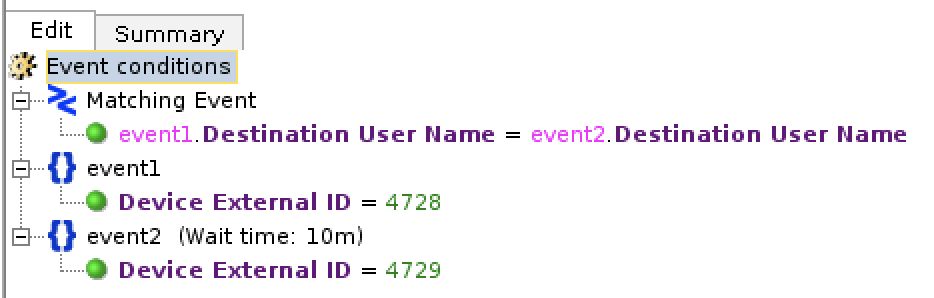
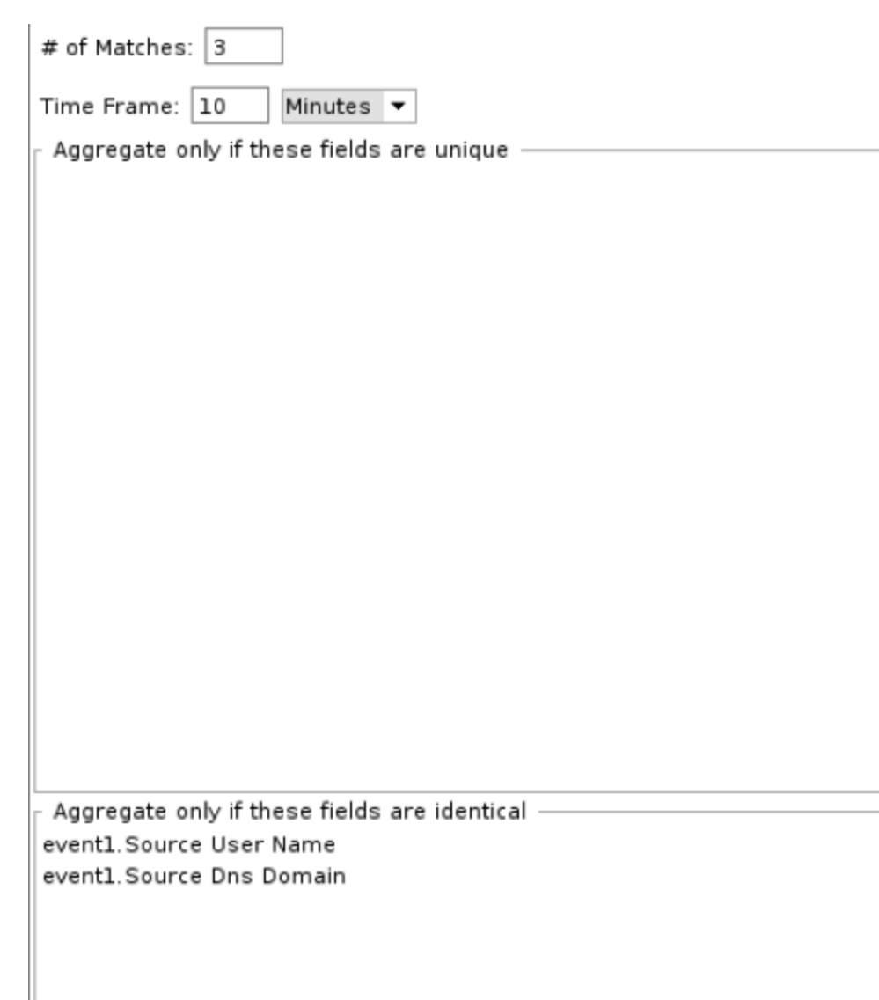
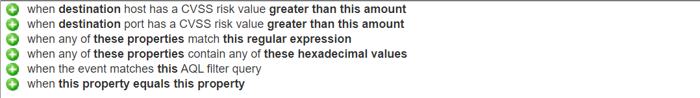
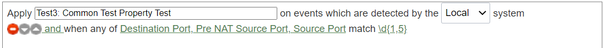
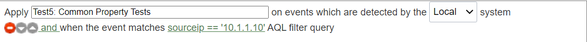
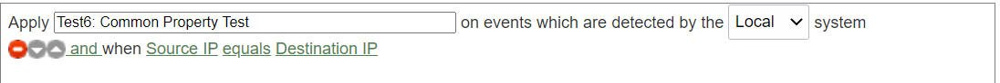
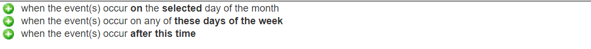
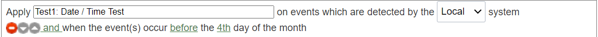
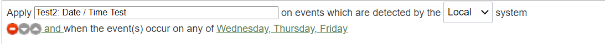
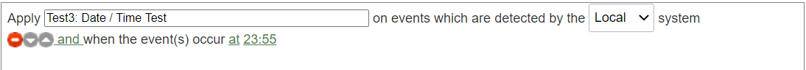

<h1>Sample Rule Criteria Mapping for ArcSight/QRadar -> Azure Sentinel</h1>
 
<h2><u>ArcSight</u></h2>
 

| No. | Type | Sample Detection Rule &nbsp; &nbsp; &nbsp; &nbsp; &nbsp; &nbsp; &nbsp; &nbsp; &nbsp; &nbsp; &nbsp; | Sample KQL | Reference |
|---|---|---|---|---|
| 1.  | **Filter** (and) |  |  <pre>SecurityEvent \| where EventID == 4728 \| where isnotempty(SubjectDomainName) \| where SubjectUserName =\~ "AutoMatedService" </pre>     \*This assumes that the Windows Security Events are collected via MMA/AMA. Hence, we are using SecurityEvent table in Azure Sentinel.  Note: Avoid case-insensitive operators (=\~) when possible for query optimization.  | [String Operators](https://docs.microsoft.com/en-us/azure/data-explorer/kusto/query/datatypes-string-operators#operators-on-strings) [Numerical Operators](https://docs.microsoft.com/en-us/azure/data-explorer/kusto/query/numoperators) [ago](https://docs.microsoft.com/en-us/azure/data-explorer/kusto/query/agofunction) [Datetime/timespan arithmetric](https://docs.microsoft.com/en-us/azure/data-explorer/kusto/query/datetime-timespan-arithmetic) [between](https://docs.microsoft.com/en-us/azure/data-explorer/kusto/query/betweenoperator) [now](https://docs.microsoft.com/en-us/azure/data-explorer/kusto/query/nowfunction)  [parse](https://docs.microsoft.com/en-us/azure/data-explorer/kusto/query/parseoperator) [extract](https://docs.microsoft.com/en-us/azure/data-explorer/kusto/query/extractfunction) [parse_json](https://docs.microsoft.com/en-us/azure/data-explorer/kusto/query/parsejsonfunction) [parse_csv](https://docs.microsoft.com/en-us/azure/data-explorer/kusto/query/parsecsvfunction) [parse_path](https://docs.microsoft.com/en-us/azure/data-explorer/kusto/query/parsepathfunction) [parse_url](https://docs.microsoft.com/en-us/azure/data-explorer/kusto/query/parseurlfunction)  |
| 2   |   **Filter** (or)   |    {width=200px} |***Option 1: Use 'in'***  <pre>SecurityEvent \| where SubjectUserName in ("Adm1","ServiceAccount1","AutomationServices")</pre> ***Option 2: Use 'or'***  <pre>SecurityEvent \| where SubjectUserName == "Adm1" or SubjectUserName == "ServiceAccount1" or SubjectUserName == "AutomationServices"</pre> | [String Operators](https://docs.microsoft.com/en-us/azure/data-explorer/kusto/query/datatypes-string-operators#operators-on-strings) [in](https://docs.microsoft.com/en-us/azure/data-explorer/kusto/query/inoperator)    
| 3   | **Nested Filter**  |     "/All Filters/Soc Filters/Exclude Valid Users":   | There are a few options to translate this in Azure Sentinel:  ***Option 1: Direct filter with "where" statement***  <pre>SecurityEvent \| where EventID == 4728  \| where isnotempty(SubjectDomainName) or isnotempty(TargetDomainName)  \| where SubjectUserName !\~ "AutoMatedService"</pre> ***Option 2: Use KQL function***    1. Save the following query as KQL function with the alias of “ExcludeValidUsers”.  <pre>SecurityEvent \| where EventID == 4728 \| where isnotempty(SubjectDomainName) \| where SubjectUserName =\~ "AutoMatedService" \| project SubjectUserName</pre>   2. After that, use the following query to filter "ExcludeValidUsers"  <pre>SecurityEvent \| where EventID == 4728 \| where isnotempty(SubjectDomainName) or isnotempty(TargetDomainName) \| where SubjectUserName !in (ExcludeValidUsers)</pre> ***Option 3: Use parameter function***   1. Create a parameter function with the name and alias of “ExcludeValidUsers”.   2. Define the parameters of the function. For example, <pre>Tbl: (TimeGenerated:datatime, Computer:string, EventID:string, SubjectDomainName:string, TargetDomainName:string, SubjectUserName:string)</pre>  3. The parameter function has the following query:<pre>Tbl \| where SubjectUserName !\~ "AutoMatedService"</pre> 4. Invoke the parameter function with the following query:   <pre>let Events = (SecurityEvent \| where EventID == 4728); ExcludeValidUsers(Events)</pre>  ***Option 4: Use Join***  <pre>let events = ( SecurityEvent \| where EventID == 4728 \| where isnotempty(SubjectDomainName) or isnotempty(TargetDomainName) ); let ExcludeValidUsers = ( SecurityEvent \| where EventID == 4728 \| where isnotempty(SubjectDomainName) \| where SubjectUserName =\~ "AutoMatedService" ); events \| join kind=leftanti ExcludeValidUsers on \$left.SubjectUserName == \$right.SubjectUserName</pre> ***Note:*** Avoid case-insensitive operators (=\~) when possible for query optimization.   | [Sample KQL function](https://techcommunity.microsoft.com/t5/azure-sentinel/using-kql-functions-to-speed-up-analysis-in-azure-sentinel/ba-p/712381) [Sample Parameter function](../../../Downloads/Enriching%20Windows%20Security%20Events%20with%20Parameterized%20Function%20-%20Microsoft%20Tech%20Community) [Join](https://docs.microsoft.com/en-us/azure/data-explorer/kusto/query/joinoperator?pivots=azuredataexplorer) [where](https://docs.microsoft.com/en-us/azure/data-explorer/kusto/query/whereoperator)    |
| 4   | **Active list**  (Lookup)   |    |<pre>let Activelist=( \_GetWatchlist('Cyber-Ark Exception Accounts') \| project Account ); CommonSecurityLog \| where DeviceVendor == "Cyber-Ark" \| where DeviceCustomNumber1 != "" \| where DeviceAction == "Get File Request" \| where DestinationUserName in (Activelist) \| project DeviceAction, DestinationUserName, TimeGenerated, SourceHostName, SourceUserName, DeviceEventClassID</pre> \*This assumes the Watchlist 'Cyber-Ark Exception Accounts' has been created in Azure Sentinel with an Account field. | Watchlist is the “Active list” equivalent feature in Azure Sentinel. Learn more about Watchlist with the following link: [Watchlist](https://docs.microsoft.com/en-us/azure/sentinel/watchlists)  However, Watchlist is just one of the methods to implement lookups and you might not need to use Watchlist all the time. Refer to the below blog post for more options: [Implementing Lookups in Azure Sentinel](https://techcommunity.microsoft.com/t5/azure-sentinel/implementing-lookups-in-azure-sentinel/ba-p/1091306)   |
|  5  | **Correlation**  (Match a rule condition against a set of base events) |   |<pre>let event1 =( SecurityEvent \| where EventID == 4728 ); let event2 =( SecurityEvent \| where EventID == 4729 ); event1 \| join kind=inner event2 on \$left.TargetUserName==\$right.TargetUserName</pre>|Join: [Join](https://docs.microsoft.com/en-us/azure/data-explorer/kusto/query/joinoperator?pivots=azuredataexplorer) [Time Window join](https://docs.microsoft.com/en-us/azure/data-explorer/kusto/query/join-timewindow) [Shuffle](https://docs.microsoft.com/en-us/azure/data-explorer/kusto/query/shufflequery) [Broadcast](https://docs.microsoft.com/en-us/azure/data-explorer/kusto/query/broadcastjoin)  [Union](https://docs.microsoft.com/en-us/azure/data-explorer/kusto/query/unionoperator?pivots=azuredataexplorer)  Define statement: [let](https://docs.microsoft.com/en-us/azure/data-explorer/kusto/query/letstatement)   Aggregation: [make_set](https://docs.microsoft.com/en-us/azure/data-explorer/kusto/query/makeset-aggfunction) [make_list](https://docs.microsoft.com/en-us/azure/data-explorer/kusto/query/makelist-aggfunction) [make_bag](https://docs.microsoft.com/en-us/azure/data-explorer/kusto/query/make-bag-aggfunction) [pack](https://docs.microsoft.com/en-us/azure/data-explorer/kusto/query/packfunction)  |
| 6   | **Correlation** (Time Window Filter)  |   |<pre>let waittime = 10m; let lookback = 1d; let event1 = ( SecurityEvent \| where TimeGenerated \> ago(waittime+lookback) \| where EventID == 4728 \| project event1_time = TimeGenerated, event1_ID = EventID, event1_Activity= Activity, event1_Host = Computer, TargetUserName, event1_UPN=UserPrincipalName,AccountUsedToAdd = SubjectUserName ); let event2 = ( SecurityEvent \| where TimeGenerated \> ago(waittime) \| where EventID == 4729 \| project event2_time = TimeGenerated, event2_ID = EventID,event2_Activity= Activity, event2_Host= Computer, TargetUserName, event2_UPN=UserPrincipalName,AccountUsedToRemove = SubjectUserName );  event1 \| join kind=inner event2 on TargetUserName \| where event2_time - event1_time \< lookback \| where tolong(event2_time - event1_time ) \>=0 \| project delta_time = event2_time - event1_time, event1_time,event2_time, event1_ID,event2_ID,event1_Activity,event2_Activity,TargetUserName, AccountUsedToAdd,AccountUsedToRemove, event1_Host,event2_Host,event1_UPN,event2_UPN</pre>|[Join](https://docs.microsoft.com/en-us/azure/data-explorer/kusto/query/joinoperator?pivots=azuredataexplorer) [Azure Sentinel Correlation Rules : Join](https://techcommunity.microsoft.com/t5/azure-sentinel/azure-sentinel-correlation-rules-the-join-kql-operator/ba-p/1041500)  |
| 7   | **Aggregation**  |  | <pre>SecurityEvent \| summarize Count = count() by SubjectUserName, SubjectDomainName \| where Count \>3</pre> | [summarize](https://docs.microsoft.com/en-us/azure/data-explorer/kusto/query/summarizeoperator) |
| | | | | |

 
 
 
 
<h2><u>QRadar</u></h2>
 

| No. | Type  | Syntax example | Sample KQL | Reference |
|---|---|---|---|---|
| 1.  | Common Property Tests  | Syntax: | See below for each statement separately | |
| | | and when any of **\<these properties\>** match **\<this regular expression\>**  Example  |<pre>CommonSecurityLog \| where tostring(SourcePort) matches regex @"\\d{1,5}" or tostring(DestinationPort) matches regex @"\\d{1,5}"</pre>|[matches regex](https://docs.microsoft.com/en-us/azure/data-explorer/kusto/query/re2)|
| | | and when the event matches \<**this\>** AQL filter query  Example  |<pre>CommonSecurityLog \| where SourceIP == '10.1.1.10'</pre>|  [String Operators](https://docs.microsoft.com/en-us/azure/data-explorer/kusto/query/datatypes-string-operators#operators-on-strings)  |
| |  | and when **\<this property\> \<equals/not equals\> \<this property\>**  Example  |<pre>CommonSecurityLog \| where SourceIP == DestinationIP</pre> |  [String Operators](https://docs.microsoft.com/en-us/azure/data-explorer/kusto/query/datatypes-string-operators#operators-on-strings) |
| 2.  | Date/Time Tests        | Syntax:  | See below for each statement separately |  [Date and time operations](https://docs.microsoft.com/en-us/azure/data-explorer/kusto/query/samples?pivots=azuremonitor#date-and-time-operations)   |
| | | and when the event(s) occur \<**on/after/before\>** the \<**selected\>** day of the month  Example  |<pre>SecurityEvent \| where dayofmonth(TimeGenerated) \< 4</pre>|  [dayofmonth()](https://docs.microsoft.com/en-us/azure/data-explorer/kusto/query/dayofmonthfunction) |
| | | and when the event(s) occur on any of \<**these days of the week{Monday, Tuesday, Wednesday, Thursday, Friday, Saturday, Sunday}\>**  Example                                                                                                                                                 | <pre>SecurityEvent \| where dayofweek(TimeGenerated) in (time(3),time(4),time(5))</pre>|  [dayofweek()](https://docs.microsoft.com/en-us/azure/data-explorer/kusto/query/dayofweekfunction) |
|  | | and when the event(s) occur \<**after/before/at\> \<this time{12.00AM, 12.05AM, ...11.50PM, 11.55PM}\>**  Example   |<pre>SecurityEvent \| where format_datetime(TimeGenerated,'HH:mm')=="23:55"</pre>    \*TimeGenerated is in UTC/GMT  |  [format_datetime()](https://docs.microsoft.com/en-us/azure/data-explorer/kusto/query/format-datetimefunction) |
| 3.  | Event property Tests   |   | See below for each statement separately  | |
| | |  and when the IP protocol is one of the following **\<protocols\>** |<pre>CommonSecurityLog \| where Protocol in ("UDP","ICMP")</pre>|  [String Operators](https://docs.microsoft.com/en-us/azure/data-explorer/kusto/query/datatypes-string-operators#operators-on-strings)|
| | |  and when the Event Payload contains **\<this string**\> |<pre>search "Palo Alto"</pre> Note: Avoid using "search" command if you already know the table name as it is not performance optimized.  |  [search()](https://docs.microsoft.com/en-us/azure/data-explorer/kusto/query/searchoperator?pivots=azuredataexplorer) |
| 4.  | Functions - Counters   |   | See below for each statement separately | |
| | |  and when at least **\<this many\>** events are seen with the same **\<event properties\>** in **\<this many\> \<minutes\>**                                                                                                                                                                  |<pre>CommonSecurityLog \| summarize Count = count() by SourceIP, DestinationIP \| where Count \>= 5</pre>|  [summarize](https://docs.microsoft.com/en-us/azure/data-explorer/kusto/query/summarizeoperator)  |
| 5.  | Functions - Negative   |  | See below for each statement separately   |   |
|  |  | and when none of **\<these rules\>** match in **\<this many\> \<minutes\>** after **\<these rules\>** match with the same **\<event properties\>**    Example using the rules defined above:    |<pre>let spanoftime = 10m; let Test2 = ( CommonSecurityLog \| where Protocol !in ("UDP","ICMP") \| where TimeGenerated \> ago(spanoftime) ); let Test6 = ( CommonSecurityLog \| where SourceIP == DestinationIP ); Test2 \| join kind=rightanti Test6 on \$left. SourceIP == \$right. SourceIP and \$left. Protocol ==\$right. Protocol</pre>|  [join()](https://docs.microsoft.com/en-us/azure/data-explorer/kusto/query/joinoperator?pivots=azuredataexplorer) [String Operators](https://docs.microsoft.com/en-us/azure/data-explorer/kusto/query/datatypes-string-operators#operators-on-strings) [Numerical Operators](https://docs.microsoft.com/en-us/azure/data-explorer/kusto/query/numoperators)   |
| 6.  | Functions – Simple     |   | See below for each statement separately  |  |
| || and when an event matches **\<any\|all\>** of the following **\<rules\>**  Example  |<pre>let Test2 = ( CommonSecurityLog \| where Protocol !in ("UDP","ICMP") ); let Test6 = ( CommonSecurityLog \| where SourceIP == DestinationIP ); union Test2, Test6</pre>|  [union()](https://docs.microsoft.com/en-us/azure/data-explorer/kusto/query/unionoperator?pivots=azuredataexplorer) |
| 7.  | IP / Port Tests  |  | See below for each statement separately  |  |
|  |   |  and when the source port is one of the following **\<ports\>**  Example   |<pre>CommonSecurityLog \| where SourcePort == 20</pre>||
|  |  |  and when the source IP is one of the following **\<IP addresses\>**  Example   |<pre>CommonSecurityLog \| where SourceIP in (“10.1.1.1”,”10.2.2.2”)</pre>| |
| 8.  | Log Source Tests |  | See below for each statement separately  | |
| |  |  and when the event(s) were detected by one or more of these **\<log source types\>**  Example   |  <pre>OfficeActivity \| where OfficeWorkload == "Exchange"</pre>| |
