<h1>Sample Rule Mapping between ArcSight/QRadar and Azure Sentinel</h1>
 
<h2>ArcSight</h2>
 

| No. 	| Type         	| Sample Detection Rule                       	| Sample KQL 	| Reference      	|
|-----	|--------------	|---------------------------------------------	|------------	|----------------	|
|1.   	|**Filter** (and)|  	|  <pre>SecurityEvent \| where EventID == 4728 \| where SubjectUserName =~ "AutoMatedService" \| where isnotempty(SubjectDomainName)</pre> This assumes that the Windows Security Events are collected via MMA/AMA. Hence, we are using SecurityEvent table in Azure Sentinel.  **Note:**   - Avoid case-insensitive operators (=~) when possible for query optimization.   - Use (==) if the value is not case-sensitive.  - Order the filters by starting with the 'where' statement that filter out the most data.  | - [String Operators](https://docs.microsoft.com/azure/data-explorer/kusto/query/datatypes-string-operators#operators-on-strings) - [Numerical Operators](https://docs.microsoft.com/azure/data-explorer/kusto/query/numoperators) - [ago](https://docs.microsoft.com/azure/data-explorer/kusto/query/agofunction) - [Datetime](https://docs.microsoft.com/azure/data-explorer/kusto/query/datetime-timespan-arithmetic) - [between](https://docs.microsoft.com/azure/data-explorer/kusto/query/betweenoperator) - [now](https://docs.microsoft.com/azure/data-explorer/kusto/query/nowfunction) - [parse](https://docs.microsoft.com/azure/data-explorer/kusto/query/parseoperator) - [extract](https://docs.microsoft.com/azure/data-explorer/kusto/query/extractfunction) - [parse_json](https://docs.microsoft.com/azure/data-explorer/kusto/query/parsejsonfunction) - [parse_csv](https://docs.microsoft.com/azure/data-explorer/kusto/query/parsecsvfunction) - [parse_path](https://docs.microsoft.com/azure/data-explorer/kusto/query/parsepathfunction) - [parse_url](https://docs.microsoft.com/azure/data-explorer/kusto/query/parseurlfunction) 	
|2.    | **Filter** (or)  |   |***Option 1: Use 'in'*** <pre>SecurityEvent \| where SubjectUserName in  ("Adm1","ServiceAccount1","AutomationServices")</pre> ***Option 2: Use 'or'*** <pre>SecurityEvent \| where SubjectUserName == "Adm1" or  SubjectUserName == "ServiceAccount1" or  SubjectUserName == "AutomationServices"</pre> | - [String Operators](https://docs.microsoft.com/azure/data-explorer/kusto/query/datatypes-string-operators#operators-on-strings) - [in](https://docs.microsoft.com/azure/data-explorer/kusto/query/inoperator)  
|3.   | **Nested Filter**  |     __"/All Filters/Soc Filters/Exclude Valid Users":__     | There are a few options to translate this in Azure Sentinel:  ***Option 1: Direct filter with "where" statement***  <pre>SecurityEvent \| where EventID == 4728  \| where isnotempty(SubjectDomainName) or isnotempty(TargetDomainName)  \| where SubjectUserName !\~ "AutoMatedService"</pre>**Note:** Avoid case-insensitive operators (!~) when possible for query optimization. Use (!=) if the value is not case-sensitive.  ***Option 2: Use KQL function***    1. Save the following query as KQL function with the alias of "ExcludeValidUsers". <pre>SecurityEvent \| where EventID == 4728 \| where isnotempty(SubjectDomainName) \| where SubjectUserName =\~ "AutoMatedService" \| project SubjectUserName</pre>2. After that, use the following query to filter "ExcludeValidUsers" <pre>SecurityEvent \| where EventID == 4728 \| where isnotempty(SubjectDomainName) or isnotempty(TargetDomainName) \| where SubjectUserName !in (ExcludeValidUsers)</pre> ***Option 3: Use parameter function***   1. Create a parameter function with the name and alias of “ExcludeValidUsers”.   2. Define the parameters of the function. For example, <pre>Tbl: (TimeGenerated:datatime, Computer:string, EventID:string,  SubjectDomainName:string, TargetDomainName:string,  SubjectUserName:string)</pre>  3. The parameter function has the following query:<pre>Tbl \| where SubjectUserName !\~ "AutoMatedService"</pre> 4. Invoke the parameter function with the following query:  <pre>let Events = ( SecurityEvent  \| where EventID == 4728 ); ExcludeValidUsers(Events)</pre> ***Option 4: Use Join***  Least preferred option. Avoid using 'join' when it can be done other options. <pre>let events = ( SecurityEvent \| where EventID == 4728 \| where isnotempty(SubjectDomainName)  or isnotempty(TargetDomainName) ); let ExcludeValidUsers = ( SecurityEvent \| where EventID == 4728 \| where isnotempty(SubjectDomainName) \| where SubjectUserName =\~ "AutoMatedService" ); events \| join kind=leftanti ExcludeValidUsers on  \$left.SubjectUserName == \$right.SubjectUserName</pre>***Note:*** Avoid case-insensitive operators (=\~) when possible for query optimization.   |-   [Sample KQL function.](https://techcommunity.microsoft.com/t5/azure-sentinel/using-kql-functions-to-speed-up-analysis-in-azure-sentinel/ba-p/712381) - [Sample Parameter function.](../../../Downloads/Enriching%20Windows%20Security%20Events%20with%20Parameterized%20Function%20-%20Microsoft%20Tech%20Community) - [Join](https://docs.microsoft.com/azure/data-explorer/kusto/query/joinoperator?pivots=azuredataexplorer) - [where](https://docs.microsoft.com/azure/data-explorer/kusto/query/whereoperator)
|4.   | **Active list**  (Lookup)   | 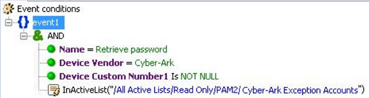   |This assumes the Watchlist 'Cyber-Ark Exception Accounts' has been created in Azure Sentinel with an 'Account' field.  <pre>let Activelist=( \_GetWatchlist('Cyber-Ark Exception Accounts') \| project Account ); CommonSecurityLog \| where DestinationUserName in (Activelist) \| where DeviceVendor == "Cyber-Ark" \| where DeviceAction == "Get File Request" \| where DeviceCustomNumber1 != "" \| project DeviceAction, DestinationUserName, TimeGenerated, SourceHostName, SourceUserName, DeviceEventClassID</pre>**Note:** Order the filters by starting with the 'where' statement that filter out the most data. | Watchlist is the “Active list” equivalent feature in Azure Sentinel. Learn more about Watchlist with the following link: - [Watchlist](https://docs.microsoft.com/azure/sentinel/watchlists)  However, Watchlist is just one of the methods to implement lookups and you might not need to use Watchlist all the time. Refer to the below blog post for more options: - [Implementing Lookups in Azure Sentinel](https://techcommunity.microsoft.com/t5/azure-sentinel/implementing-lookups-in-azure-sentinel/ba-p/1091306)   
|5.  | **Correlation**  (Match a rule condition against a set of base events) |  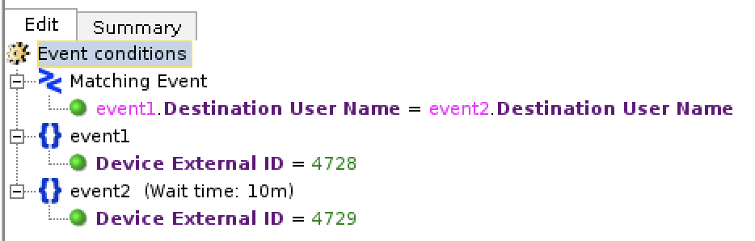 | <pre>let event1 =( SecurityEvent \| where EventID == 4728 ); let event2 =( SecurityEvent \| where EventID == 4729 ); event1 \| join kind=inner event2  on \$left.TargetUserName==\$right.TargetUserName</pre>**Note:** For optimization, make sure the smaller table is on the left side of the join. Also, if the left side is relatively small (up to 100K records), add `hint.strategy=broadcast` for better performance. | Join: - [Join](https://docs.microsoft.com/azure/data-explorer/kusto/query/joinoperator?pivots=azuredataexplorer) - [Time Window Join](https://docs.microsoft.com/azure/data-explorer/kusto/query/join-timewindow) - [Shuffle](https://docs.microsoft.com/azure/data-explorer/kusto/query/shufflequery) - [Broadcast](https://docs.microsoft.com/azure/data-explorer/kusto/query/broadcastjoin) - [Union](https://docs.microsoft.com/azure/data-explorer/kusto/query/unionoperator?pivots=azuredataexplorer)  Define statement: - [let](https://docs.microsoft.com/azure/data-explorer/kusto/query/letstatement)   Aggregation: - [make_set](https://docs.microsoft.com/azure/data-explorer/kusto/query/makeset-aggfunction) - [make_list](https://docs.microsoft.com/azure/data-explorer/kusto/query/makelist-aggfunction) - [make_bag](https://docs.microsoft.com/azure/data-explorer/kusto/query/make-bag-aggfunction) - [pack](https://docs.microsoft.com/azure/data-explorer/kusto/query/packfunction)  
|6.  | **Correlation** (Time Window Filter)  |   |<pre>let waittime = 10m; let lookback = 1d; let event1 = ( SecurityEvent \| where TimeGenerated \> ago(waittime+lookback) \| where EventID == 4728 \| project event1_time = TimeGenerated, event1_ID = EventID,  event1_Activity= Activity, event1_Host = Computer, TargetUserName,  event1_UPN=UserPrincipalName, AccountUsedToAdd = SubjectUserName  ); let event2 = ( SecurityEvent \| where TimeGenerated \> ago(waittime) \| where EventID == 4729 \| project event2_time = TimeGenerated, event2_ID = EventID,  event2_Activity= Activity, event2_Host= Computer, TargetUserName,   event2_UPN=UserPrincipalName,AccountUsedToRemove = SubjectUserName  );  event1 \| join kind=inner event2 on TargetUserName \| where event2_time - event1_time \< lookback \| where tolong(event2_time - event1_time ) \>=0 \| project delta_time = event2_time - event1_time, event1_time,  event2_time, event1_ID,event2_ID,event1_Activity, event2_Activity,  TargetUserName, AccountUsedToAdd, AccountUsedToRemove,  event1_Host,event2_Host, event1_UPN,event2_UPN</pre>|- [Join](https://docs.microsoft.com/en-us/azure/data-explorer/kusto/query/joinoperator?pivots=azuredataexplorer) - [Azure Sentinel Correlation Rules : Join](https://techcommunity.microsoft.com/t5/azure-sentinel/azure-sentinel-correlation-rules-the-join-kql-operator/ba-p/1041500)
|7.  | **Aggregation**  | 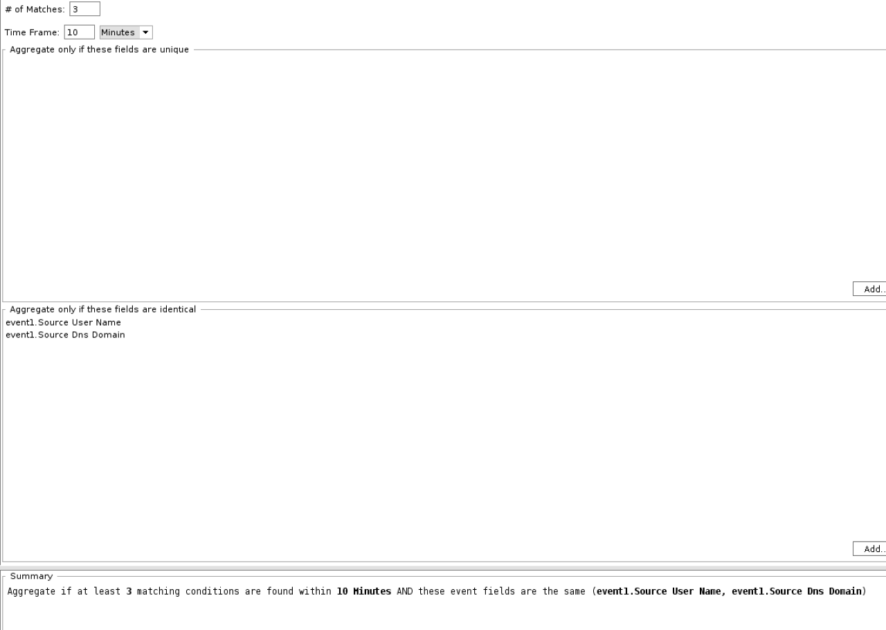 | <pre>SecurityEvent \| summarize Count = count() by SubjectUserName, SubjectDomainName \| where Count \>3</pre> |- [summarize](https://docs.microsoft.com/en-us/azure/data-explorer/kusto/query/summarizeoperator)
  
 
 
 
 
<h2>QRadar</h2>
 

| No. 	| Type         	| Sample Detection Rule                       	| Sample KQL 	| Reference      	|
|-----	|--------------	|---------------------------------------------	|------------	|----------------	|
|1. | **Common Property Tests**  | Syntax: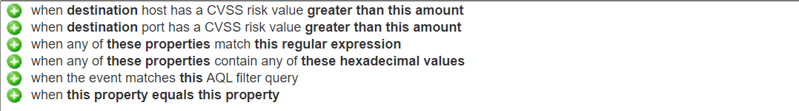 | See below for each statement separately: | |
| | | and when any of **\<these properties\>** match **\<this regular expression\>**  Example 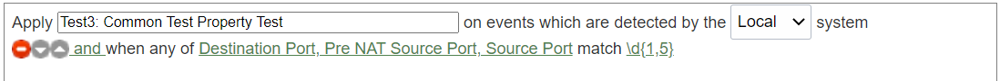 |<pre>CommonSecurityLog \| where tostring(SourcePort)  matches regex @"\\d{1,5}"  or tostring(DestinationPort)  matches regex @"\\d{1,5}"</pre>|- [matches regex](https://docs.microsoft.com/en-us/azure/data-explorer/kusto/query/re2)|
| | | and when the event matches \<**this\>** AQL filter query  Example 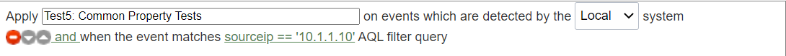 |<pre>CommonSecurityLog \| where SourceIP == '10.1.1.10'</pre>|-  [String Operators](https://docs.microsoft.com/en-us/azure/data-explorer/kusto/query/datatypes-string-operators#operators-on-strings)  |
| |  | and when **\<this property\> \<equals/not equals\> \<this property\>**  Example 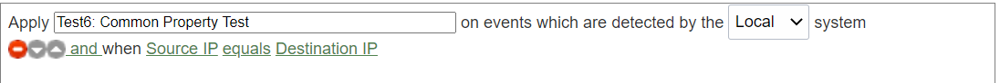 |<pre>CommonSecurityLog \| where SourceIP == DestinationIP</pre> |-  [String Operators](https://docs.microsoft.com/en-us/azure/data-explorer/kusto/query/datatypes-string-operators#operators-on-strings)
|2. | **Date/Time Tests**  |Syntax: 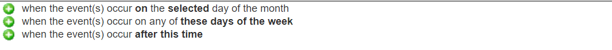 | See below for each statement separately: |-  [Date and time operations](https://docs.microsoft.com/en-us/azure/data-explorer/kusto/query/samples?pivots=azuremonitor#date-and-time-operations)   |
| | | and when the event(s) occur \<**on/after/before\>** the \<**selected\>** day of the month  Example 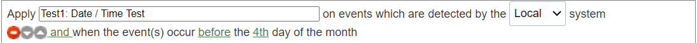 |<pre>SecurityEvent \| where dayofmonth(TimeGenerated) \< 4</pre>|-  [dayofmonth()](https://docs.microsoft.com/en-us/azure/data-explorer/kusto/query/dayofmonthfunction) |
| | | and when the event(s) occur on any of \<**these days of the week{Monday, Tuesday, Wednesday, Thursday, Friday, Saturday, Sunday}\>**  Example 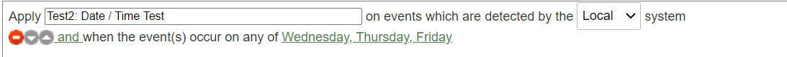                                                                                                                                                | <pre>SecurityEvent \| where dayofweek(TimeGenerated) between (3d .. 5d)</pre>|-  [dayofweek()](https://docs.microsoft.com/en-us/azure/data-explorer/kusto/query/dayofweekfunction) |
|  | | and when the event(s) occur \<**after/before/at\> \<this time{12.00AM, 12.05AM, ...11.50PM, 11.55PM}\>**  Example 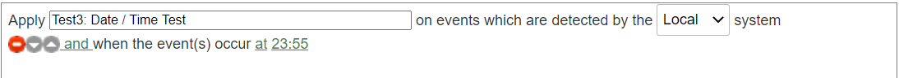  |<pre>SecurityEvent \| where format_datetime(TimeGenerated,'HH:mm') =="23:55"</pre>  **Note:** TimeGenerated is in UTC/GMT  |- [format_datetime()](https://docs.microsoft.com/en-us/azure/data-explorer/kusto/query/format-datetimefunction) 
