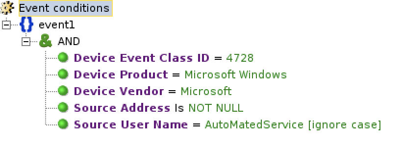
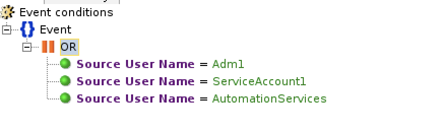
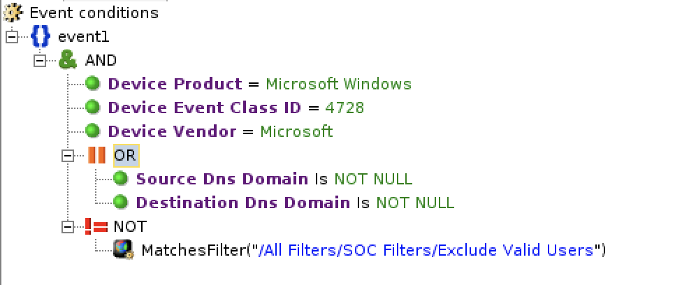
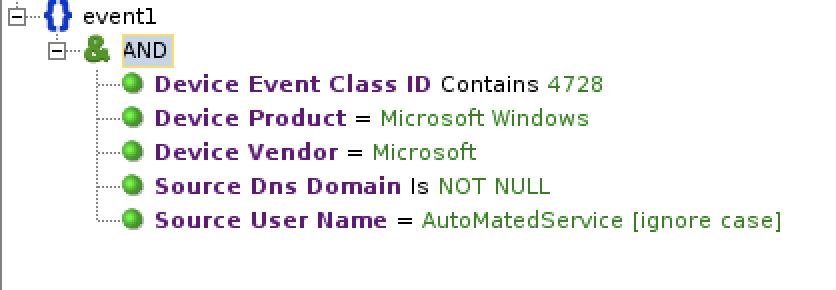

<h1>Sample Rule Mapping between ArcSight/QRadar and Azure Sentinel</h1>
 
<h2>ArcSight</h2>
 

| No. 	| Type         	| Sample Detection Rule                       	| Sample KQL 	| Reference      	|
|-----	|--------------	|---------------------------------------------	|------------	|----------------	|
| 1.   	| **Filter** (and) 	|  	|  <pre>SecurityEventSecurityEvent \| where EventID == 4728 \| where SubjectUserName =~ "AutoMatedService" \| where isnotempty(SubjectDomainName)</pre> *This assumes that the Windows Security Events are collected via MMA/AMA.  Hence, we are using SecurityEvent table in Azure Sentinel.*  **Note:**   - Avoid case-insensitive operators (=~) when possible for query optimization.   - Use (==) if the value is not case-sensitive.  - Order the filters by starting with the 'where' statement that filter out the most data. |  [String Operators](https://docs.microsoft.com/en-us/azure/data-explorer/kusto/query/datatypes-string-operators#operators-on-strings) [Numerical Operators](https://docs.microsoft.com/en-us/azure/data-explorer/kusto/query/numoperators) [ago](https://docs.microsoft.com/en-us/azure/data-explorer/kusto/query/agofunction) [Datetime/timespan arithmetric](https://docs.microsoft.com/en-us/azure/data-explorer/kusto/query/datetime-timespan-arithmetic) [between](https://docs.microsoft.com/en-us/azure/data-explorer/kusto/query/betweenoperator) [now](https://docs.microsoft.com/en-us/azure/data-explorer/kusto/query/nowfunction)  [parse](https://docs.microsoft.com/en-us/azure/data-explorer/kusto/query/parseoperator) [extract](https://docs.microsoft.com/en-us/azure/data-explorer/kusto/query/extractfunction) [parse_json](https://docs.microsoft.com/en-us/azure/data-explorer/kusto/query/parsejsonfunction) [parse_csv](https://docs.microsoft.com/en-us/azure/data-explorer/kusto/query/parsecsvfunction) [parse_path](https://docs.microsoft.com/en-us/azure/data-explorer/kusto/query/parsepathfunction) [parse_url](https://docs.microsoft.com/en-us/azure/data-explorer/kusto/query/parseurlfunction) 	
| 2.    | **Filter** (or)   |   |***Option 1: Use 'in'*** <pre>SecurityEvent \| where SubjectUserName in  ("Adm1","ServiceAccount1","AutomationServices")</pre> ***Option 2: Use 'or'*** <pre>SecurityEvent \| where SubjectUserName == "Adm1" or  SubjectUserName == "ServiceAccount1" or  SubjectUserName == "AutomationServices"</pre> |  [String Operators](https://docs.microsoft.com/en-us/azure/data-explorer/kusto/query/datatypes-string-operators#operators-on-strings) [in](https://docs.microsoft.com/en-us/azure/data-explorer/kusto/query/inoperator)  
| 3   | **Nested Filter**  |     "/All Filters/Soc Filters/Exclude Valid Users":   | There are a few options to translate this in Azure Sentinel:  ***Option 1: Direct filter with "where" statement***  <pre>SecurityEvent \| where EventID == 4728  \| where isnotempty(SubjectDomainName) or isnotempty(TargetDomainName)  \| where SubjectUserName !\~ "AutoMatedService"</pre> ***Option 2: Use KQL function***    1. Save the following query as KQL function with the alias of “ExcludeValidUsers”.  <pre>SecurityEvent \| where EventID == 4728 \| where isnotempty(SubjectDomainName) \| where SubjectUserName =\~ "AutoMatedService" \| project SubjectUserName</pre>   2. After that, use the following query to filter "ExcludeValidUsers"  <pre>SecurityEvent \| where EventID == 4728 \| where isnotempty(SubjectDomainName) or isnotempty(TargetDomainName) \| where SubjectUserName !in (ExcludeValidUsers)</pre> ***Option 3: Use parameter function***   1. Create a parameter function with the name and alias of “ExcludeValidUsers”.   2. Define the parameters of the function. For example, <pre>Tbl: (TimeGenerated:datatime, Computer:string, EventID:string,  SubjectDomainName:string, TargetDomainName:string, SubjectUserName:string)</pre>  3. The parameter function has the following query:<pre>Tbl \| where SubjectUserName !\~ "AutoMatedService"</pre> 4. Invoke the parameter function with the following query:   <pre>let Events = (SecurityEvent \| where EventID == 4728); ExcludeValidUsers(Events)</pre>  ***Option 4: Use Join***  <pre>let events = ( SecurityEvent \| where EventID == 4728 \| where isnotempty(SubjectDomainName) or isnotempty(TargetDomainName) ); let ExcludeValidUsers = ( SecurityEvent \| where EventID == 4728 \| where isnotempty(SubjectDomainName) \| where SubjectUserName =\~ "AutoMatedService" ); events \| join kind=leftanti ExcludeValidUsers on  \$left.SubjectUserName == \$right.SubjectUserName</pre> ***Note:*** Avoid case-insensitive operators (=\~) when possible for query optimization.   |  [Sample KQL function](https://techcommunity.microsoft.com/t5/azure-sentinel/using-kql-functions-to-speed-up-analysis-in-azure-sentinel/ba-p/712381) [Sample Parameter function](../../../Downloads/Enriching%20Windows%20Security%20Events%20with%20Parameterized%20Function%20-%20Microsoft%20Tech%20Community) [Join](https://docs.microsoft.com/en-us/azure/data-explorer/kusto/query/joinoperator?pivots=azuredataexplorer) [where](https://docs.microsoft.com/en-us/azure/data-explorer/kusto/query/whereoperator)   
